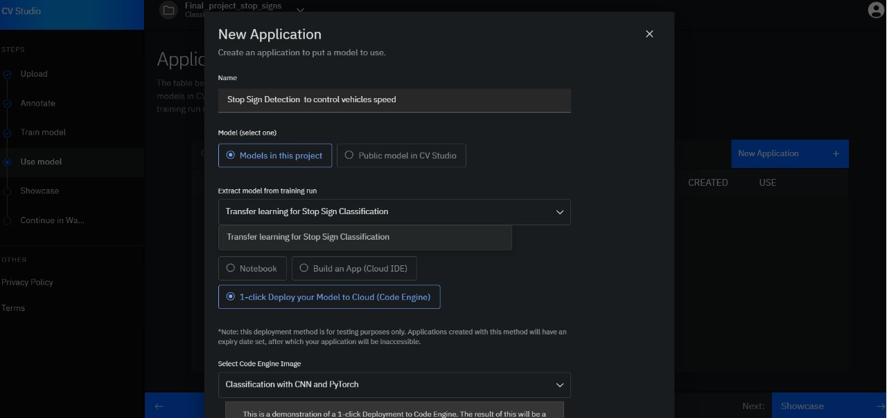
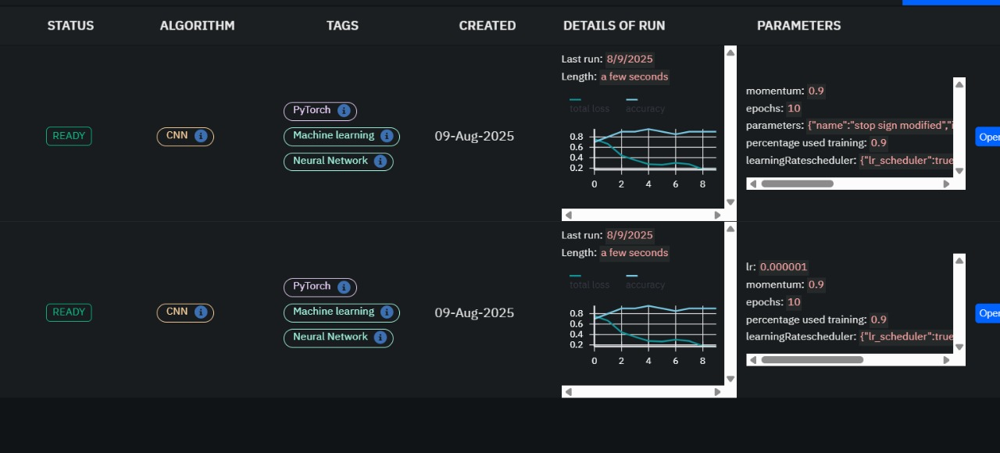

# Introduction-to-Computer-Vision-and-Image-Processing-Coursera
This repository contains the Jupyter notebooks and hands-on projects I completed as part of the course. It showcases the practical experience and skills I gained throughout the learning process.

---
## IBM Cloud Training
<!-- Add your portfolio front page image here -->

---

## Trianing Accuracy lose and hyper parameters
<!-- Add your portfolio front page image here -->

